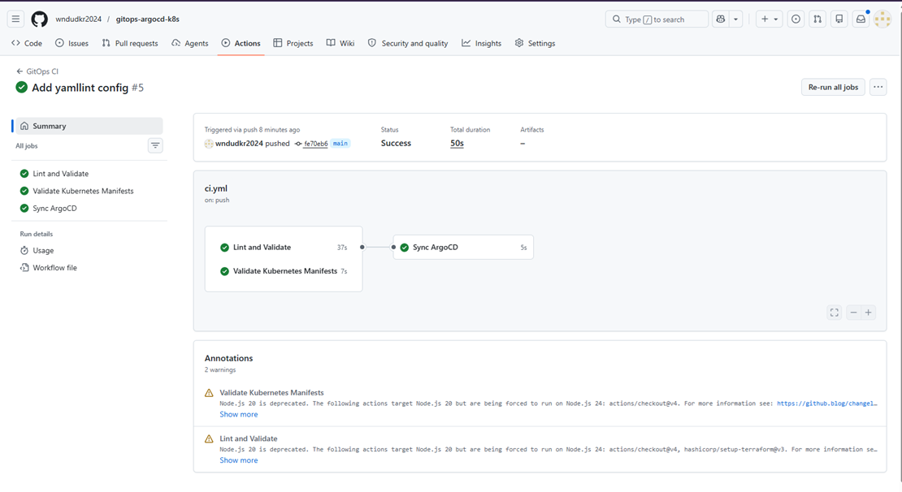
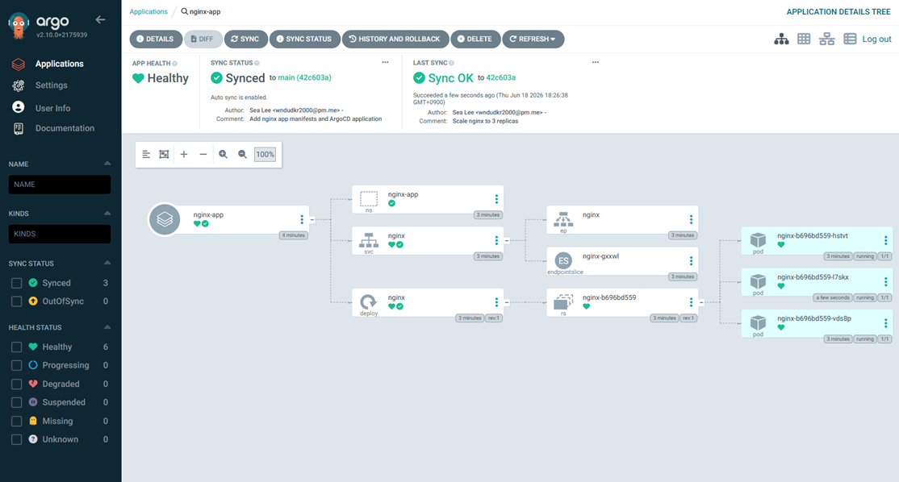
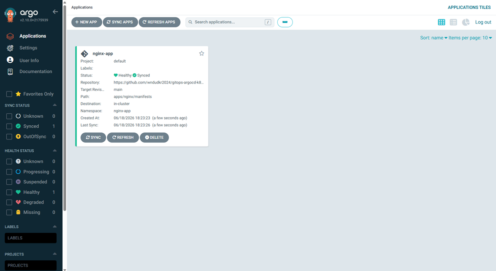
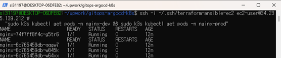

# GitOps Pipeline with ArgoCD on Kubernetes

[](https://github.com/wndudkr2024/gitops-argocd-k8s/actions/workflows/ci.yml)

Production-style GitOps pipeline using ArgoCD, k3s, Terraform, and Ansible on AWS. Push to GitHub — ArgoCD automatically deploys to Kubernetes.

---

## What This Does

1. **Terraform** provisions AWS infrastructure (VPC, Subnet, EC2)
2. **Ansible** installs k3s and deploys ArgoCD automatically
3. **ArgoCD** watches the GitHub repo and syncs changes to the cluster
4. **GitHub Actions** validates code and triggers ArgoCD sync on every push

---

## Architecture

Developer pushes to GitHub

↓

GitHub Actions CI

├── yamllint + ansible-lint

├── Terraform fmt check

├── kubeconform (manifest validation)

└── ArgoCD sync trigger

↓

ArgoCD detects changes

↓

Kubernetes cluster updated

├── nginx-dev  (1 replica)

└── nginx-prod (3 replicas)

---

## Stack

| Tool | Version |
|---|---|
| Terraform | >= 1.5.0 |
| AWS Provider | ~> 6.0 |
| k3s | v1.29.4+k3s1 |
| ArgoCD | v2.10.0 |
| Amazon Linux | 2023 |

---

## Repository Structure

.

├── terraform/          # AWS infrastructure

├── ansible/            # k3s + ArgoCD installation

├── apps/

│   └── nginx/

│       ├── dev/        # dev environment manifests

│       └── prod/       # prod environment manifests

└── argocd/             # ArgoCD Application definitions

---

## GitOps Flow

git push → GitHub Actions → ArgoCD Sync → Kubernetes

Any change to `apps/` directory is automatically detected by ArgoCD and applied to the cluster. No manual `kubectl apply` required after initial setup.

---

## Multi-Environment

| Environment | Namespace | Replicas |
|---|---|---|
| dev | nginx-dev | 1 |
| prod | nginx-prod | 3 |

---

## GitHub Actions Pipeline

| Job | Description |
|---|---|
| Lint and Validate | yamllint, ansible-lint, terraform fmt |
| Validate Kubernetes Manifests | kubeconform schema validation |
| Sync ArgoCD | Triggers immediate sync on main branch push |

---

## Usage

### 1. Provision Infrastructure

```bash
cd terraform/
terraform init
terraform apply
```

### 2. Run Ansible

```bash
cd ansible/
ansible-playbook -i inventory.ini site.yml
```

### 3. Register ArgoCD Applications

```bash
kubectl apply -f argocd/nginx-dev.yml
kubectl apply -f argocd/nginx-prod.yml
```

### 4. Deploy by pushing to GitHub

```bash
# Edit any manifest
git add .
git commit -m "Scale nginx-prod to 5 replicas"
git push origin main
# GitHub Actions triggers ArgoCD sync automatically
```

### 5. Destroy Infrastructure

```bash
cd terraform/
terraform destroy
```

---

## Screenshots

### GitHub Actions CI Pipeline



### ArgoCD Application Tree



### ArgoCD Applications



### kubectl get pods



---

## Design Principles

- **GitOps** — Git is the single source of truth
- **Automated** — No manual kubectl after initial setup
- **Multi-environment** — dev/prod isolation
- **Validated** — Every push goes through CI before deployment

---

## Disclaimer

This project demonstrates production patterns used in enterprise environments.
